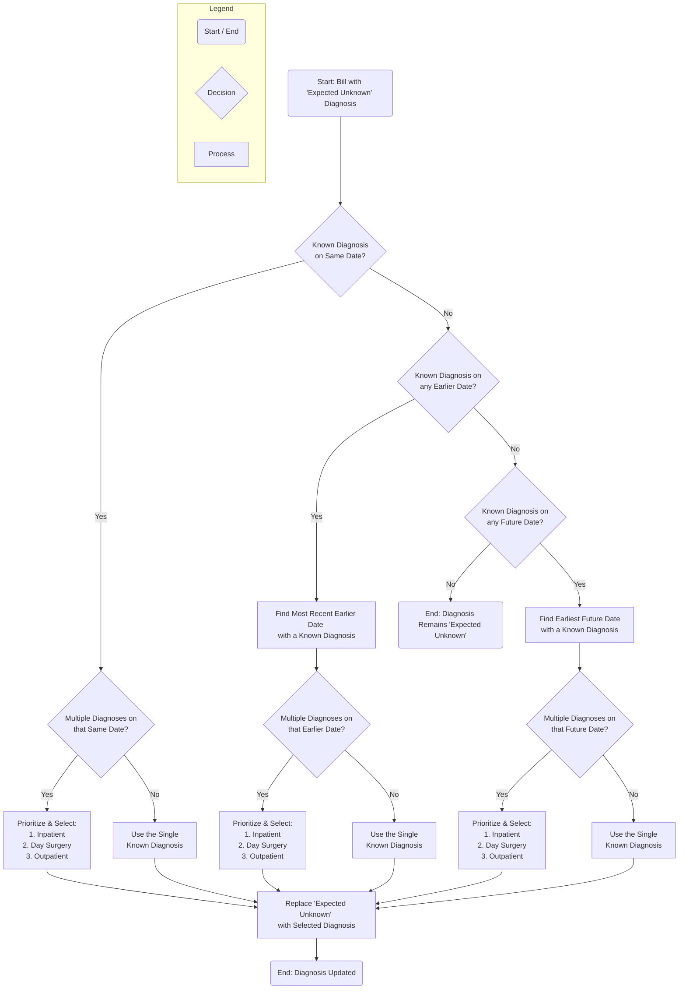

```mermaid
graph TD
    subgraph Legend
        direction LR
        L1(Start / End)
        L2{Decision}
        L3[Process]
    end

    A(Start: Bill with <br/>'Expected Unknown' Diagnosis) --> B{Known Diagnosis <br/>on Same Date?};

    B -- Yes --> C{Multiple Diagnoses on <br/>that Same Date?};
    B -- No --> F;

    C -- Yes --> D[Prioritize & Select: <br/>1. Inpatient <br/>2. Day Surgery <br/>3. Outpatient];
    C -- No --> E[Use the Single <br/>Known Diagnosis];

    D --> G[Replace 'Expected Unknown' <br/>with Selected Diagnosis];
    E --> G;

    F{Known Diagnosis on <br/>any Earlier Date?};
    F -- Yes --> H[Find Most Recent Earlier Date <br/>with a Known Diagnosis];
    F -- No --> L;

    H --> I{Multiple Diagnoses on <br/>that Earlier Date?};
    I -- Yes --> J[Prioritize & Select: <br/>1. Inpatient <br/>2. Day Surgery <br/>3. Outpatient];
    I -- No --> K[Use the Single <br/>Known Diagnosis];

    J --> G;
    K --> G;

    L{Known Diagnosis on <br/>any Future Date?};
    L -- Yes --> M[Find Earliest Future Date <br/>with a Known Diagnosis];
    L -- No --> Q(End: Diagnosis <br/>Remains 'Expected Unknown');

    M --> N{Multiple Diagnoses on <br/>that Future Date?};
    N -- Yes --> O[Prioritize & Select: <br/>1. Inpatient <br/>2. Day Surgery <br/>3. Outpatient];
    N -- No --> P[Use the Single <br/>Known Diagnosis];

    O --> G;
    P --> G;

    G --> R(End: Diagnosis Updated);
```
